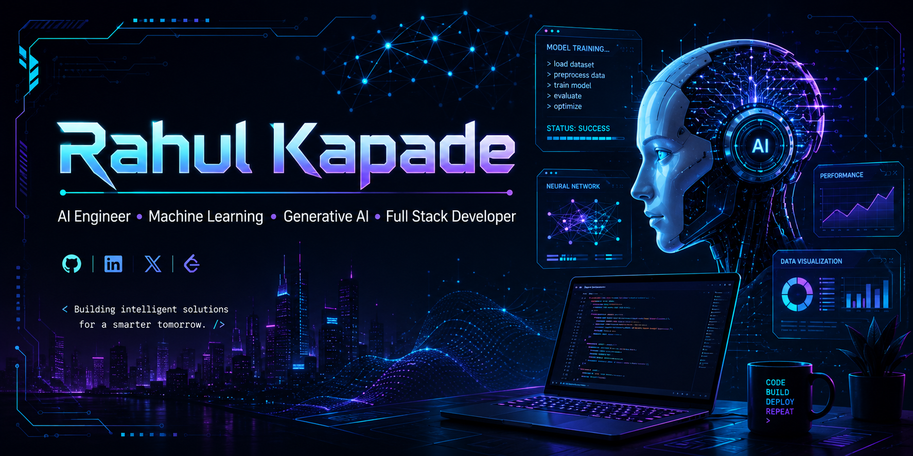

<!-- ========================================================= -->
<!--                    GITHUB PROFILE README                  -->
<!-- ========================================================= -->

<!-- 🔴 REPLACE banner.png with your uploaded banner image -->
<p align="center">
  
</p>

<h1 align="center">
Hi 👋 I'm Rahul Kapade
</h1>

<h3 align="center">
AI Engineer • Machine Learning • Generative AI • Full Stack Developer
</h3>

<p align="center">

</p>

---

# 💫 About Me

```text
╔══════════════════════════════════════════════════════════╗
║ 👨 Name       : Rahul Ramkishan Kapade                  ║
║ 🎓 Degree     : B.Tech Computer Engineering             ║
║ 🏫 College    : Terna Engineering College              ║
║ 📍 Location   : Navi Mumbai, Maharashtra               ║
║ 💻 OS         : Windows 11                             ║
║ 🌱 Learning   : Agentic AI | RAG | MCP | LLMs          ║
║ 🎯 Goal       : Build AI products used by millions     ║
╚══════════════════════════════════════════════════════════╝
```

---

# 🌐 Connect With Me

<p>

<!-- 🔴 REPLACE EMAIL -->

<a href="mailto:kapaderahul191@gmail.com">

</a>

<!-- 🔴 REPLACE IF YOUR LINKEDIN URL IS DIFFERENT -->

<a href="https://www.linkedin.com/in/rahul-kapade-1b5429385">

</a>

<a href="https://github.com/Ra-32">

</a>

</p>

---

# 💻 Tech Stack

## Languages

<p>

</p>

## Frontend

<p>

</p>

## Backend

<p>

</p>

## Database

<p>

</p>

## AI / ML

<p>


</p>

## Tools

<p>


</p>

---

# 📊 GitHub Statistics

<p align="center">


</p>

---

# 🔥 GitHub Streak

<p align="center">


</p>


---

# 📈 Contribution Graph

<p align="center">


</p>

---


</p>

---

# 🚀 Featured Projects

| Project | Description |
|----------|-------------|
| 🤖 AI Novel Engine | AI-powered story generation using LLMs |
| ❤️ Heart Disease Prediction | Machine Learning prediction model |
| 📧 Spam Email Detection | NLP + TF-IDF + Naive Bayes |
| 🎬 Movie Recommendation System | Collaborative Filtering |
| 🖼️ Image Caption Generator | CNN + LSTM + VGG16 |

---

# 🌱 Currently Learning

- 🤖 Agentic AI
- 🧠 Large Language Models
- 🔥 LangGraph
- 🔍 Retrieval-Augmented Generation (RAG)
- ⚡ Model Context Protocol (MCP)
- ☁️ AWS
- 🐳 Docker
- ☸ Kubernetes

---

# 📫 Contact

📧 **Email**

```text
🔴 REPLACE THIS

kapaderahul191@gmail.com
```

💼 **LinkedIn**

```text
https://www.linkedin.com/in/rahul-kapade-1b5429385/
```

🌐 **GitHub**

```text
https://github.com/Ra-32
```

---


<p align="center">


</p>

---

<p align="center">


</p>

---

<h3 align="center">
⭐ Thanks for visiting my profile ⭐
</h3>

<p align="center">

"Keep Learning • Keep Building • Keep Growing"

</p>
